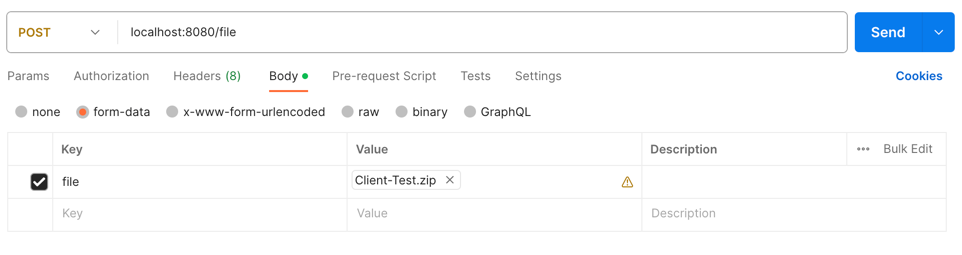

# Zip File Upload & unzip to view contents
***
App exposes an API to upload the ZIP file format via MultipartFile of Springboot. Then ZipInputStream is used to 
read the name of the files inside the zip file. These file names are then returned in the response.

## Technologies
***
A list of technologies used within the project:
* [Java](https://www.java.com/en/): Version 17
* [Spring Boot](https://spring.io/projects/spring-boot): Version 3.1.4

## Installation
***
Execute following command from the root of the project
````
mvn spring-boot:run
````

## Testing
***
### CURL Request for testing

````
curl --location 'localhost:8080/file' \
--form 'file=@"/Users/anilput1/Downloads/test.zip"'
````



## FAQ
***
### 1. What is MultipartFile in spring boot?
A representation of an uploaded file received in a multipart request. The file contents are either stored in memory 
or temporarily on disk.

[Springboot Docs - MultipartFile](https://docs.spring.io/spring-framework/docs/current/javadoc-api/org/springframework/web/multipart/MultipartFile.html)

### 2. What is a ZipInputStream?
ZipInputStream is a Java class that implements an input stream filter for reading files in the ZIP file format. 
It has support for both compressed and uncompressed entries.

[Java Docs - ZipInputStream](https://docs.oracle.com/javase/8/docs/api/java/util/zip/ZipInputStream.html)